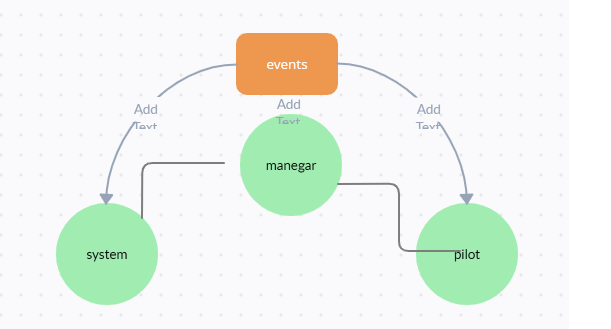

# airline-system

## 🚀 project link
https://github.com/lithhalim/auth-api

## how run

## result

## uml

## DECMUNTATION

- Implement a Module for a Global Event Pool.
- Export a single EventEmitter from the Node JS module.
- Should be imported by any module that needs to notify or be alerted by other modules of an event.
- Implement a Module for Managing Global Package Events.
- Listens to ALL events in the Event Pool.
- Logs a timestamp and the payload of every event.

#### Implementation Notes
 ###### REMINDER: Your app needs a new dependency today: sequelize
 - npm i sequelize sequelize-cli pg sqlite3
 - Remember to start your Postgres server:

